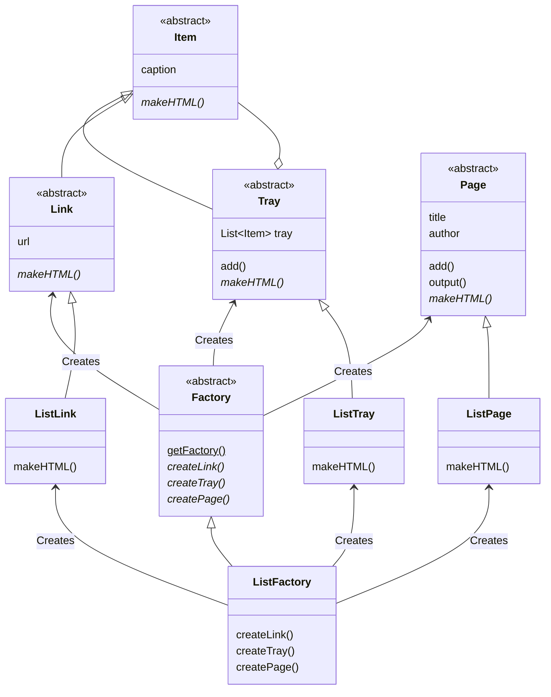
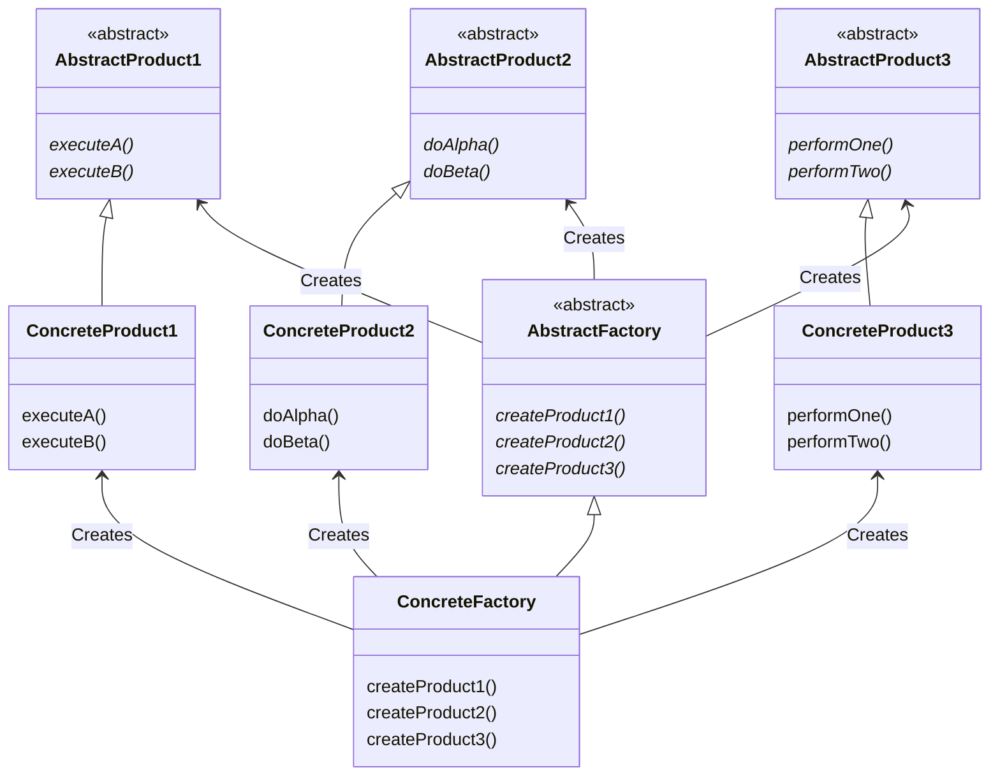

# Abstract Factory 模式

Abstract 的意思是“抽象的”，Factory 的意思是 “工厂”。将它们组合起来我们就可以知道 Abstract Factory 表示“抽象工厂”的意思。

通常，我们不会将 “抽象的” 这个词与 ”工厂“ 这个词联系到一起。所谓工厂，是将零件组装出产品的地方，这是一项具体的工作。
那么“抽象工厂”到底是什么意思呢？我们大可不必对这个词感到吃惊。因为在 Abstract Factory 模式中，不仅有“抽象工厂”，
还有“抽象零件”和“抽象产品”。**抽象工厂的工作是将“抽象零件”组装成“抽象产品”**。

我们可以回忆一下面向对象编程中的“抽象”这个词的具体含义。它指的是“不考虑具体怎样实现，而是仅关注接口（API）”的状态。
例如，抽象方法（Abstract Method）并不定义方法的具体实现，而是仅仅只确定了方法的名字和签名（参数的类型和个数）。

关于“忘记参数的具体实现（假装忘记），使用抽象方法进行编程”的设计思想，我们在 Template Method 模式和 Builder 
模式中已经稍微提及过了。在 Abstract Factory 模式中将会出现抽象工厂，它会将抽象零件组装为抽象产品。也就是说，
**我们并不关心零件的具体实现，而是只关心接口（API），我们仅仅使用该接口（API）将零件组装成为产品。**

# 示例程序
## 功能介绍
示例程序的功能时将带有层次关系的链接的集合制作成 HTML 文件。在示例程序中，类被划分为以下 3 个包。
- factory 包：包含抽象工厂、零件、产品的包
- sample1 包：包含 Main 类的包
- listfactory 包：包含具体工厂、零件、产品的包（这里使用 \<ul> 标签输出为 HTML 文件）

## 类的一览表

| 包           | 类名          | 说明                                      |
|-------------|-------------|-----------------------------------------|
| factory     | Factory     | 表示抽象工厂的类（制作 Link、Tray、Page）             |
| factory     | Item        | 方便统一处理 Link 和 Tray 的类                   |
| factory     | Link        | 抽象零件：表示 HTML 的链接的类                      |
| factory     | Tray        | 抽象零件：表示含有 Link 和 Tray 的类                |
| factory     | Page        | 抽象产品：表示 HTML 页面的类                       |
| sample1     | Main        | 测试程序行为的类                                |
| listfactory | ListFactory | 表示具体工厂的类（制作 ListLink、ListTray、ListPage） |
| listfactory | ListLink    | 具体零件：表示 HTML 的链接的类                      |
| listfactory | ListTray    | 具体零件：表示含有 Link 和 Tray 的类                |
| listfactory | ListPage    | 具体产品：表示 HTML 页面的类                       |

## 示例程序的类图


# Abstract Factory 模式中的登场角色

- AbstractProduct（抽象产品）

AbstractProduct 角色负责定义 AbstractFactory 角色所生成的抽象零件和产品的接口（API）。
在示例程序中，由 Link 类、Tray 类和 Page 类扮演此角色。

- AbstractFactory（抽象工厂）

AbstractFactory 角色负责定义用于生成抽象产品的接口（API）。
在示例程序中，由 Factory 类扮演此角色。

- Client（委托者）

Client 角色仅会调用 AbstractFactory 角色和 AbstractProduct 角色的接口（API）来工作，对于具体的零件、
产品和工厂一无所知。在示例程序中，由 Main 类扮演此角色。

- ConcreteProduct（具体产品）

ConcreteProduct 角色负责实现 AbstractProduct 角色的接口（API）。在示例程序中，由以下包中的以下类扮演此角色。
1、listfactory 包：ListLink 类、ListTray 类和 ListPage 类
2、tablefactory 包：TableLink 类、TableTray 类和 TablePage 类

- ConcreteFactory（具体工厂）

ConcreteFactory 角色负责实现 AbstractFactory 角色的接口（API）。在示例程序中，由以下包中的以下类扮演此角色。
1、listfactory 包：ListFactory 类
2、tablefactory 包：TableFactory 类

## Abstract Factory 模式的类图


# 扩展思路的要点
## 易于增加具体的工厂
在 Abstract Factory 模式中增加具体的工厂是非常容易的。这里说的“容易”指的是需要编写哪些类和需要实现哪些方法都非常清楚。

**假设现在我们要在示例程序中增加新的具体工厂，那么需要做的就是编写 Factory、Link、Tray、Page 这 4 个类的子类，
并实现它们定义的抽象方法。也就是说将 factory 包中的抽象部分全部具体化即可。**

这样一来，无论要增加多少个具体工厂（或是要修改具体工厂的 Bug），都无需修改抽象工厂和 Main 部分。

## 难以增加新的零件
如果要在 Abstract Factory 模式中增加新的零件时应当如何做。例如，我们要在 factory 包中增加一个表示图像的
Picture 零件。这时，我们必须要对所有的具体工厂进行相应的修改才行。例如，在 listfactory 包中，我们必须做出以下修改。

1、在 ListFactory 中加入 createPicture 方法
2、新增 ListPicture 类

可想而知，已编写完成的具体工厂越多，修复的工作量就会越大。

# 相关的设计模式

- Builder 模式

Abstract Factory 模式通过调用抽象产品的接口（API）来组装抽象产品，生成具有复杂结构的实例。
Builder 模式则是分阶段地制作复杂实例。
- Factory Method 模式

有时 Abstract Factory 模式中的零件和产品的生成会使用到 Factory Method 模式。


- Composite 模式

有时 Abstract Factory 模式在制作产品时会使用 Composite 模式。

- Singleton 模式

有时 Abstract Factory 模式中的具体工厂会使用 Singleton 模式。

# 延伸阅读：各种生成实例的方法的介绍
在 Java 中可以使用下面这些方法生成实例。
- new

一般像下面这样生成 Something 类的实例并将其保存在 object 变量中。

`Something obj = new Something();`

这时，类名（此处的 Something）会出现在代码中（即形成强耦合）。

- clone

我们也可以使用在 Prototype 中学过的 clone 方法，根据现有的实例复制出一个新的实例。
我们可以像下面这样根据自身来复制出新的实例（不过不会调用构造函数）

```text
class Something {
    ...
    public Something createClone() {
        Something obj = null;
        try {
            obj = (Something) clone();
        } catch (CloneNotSupportedException e) {
            e.printStackTrace();
        }
        return obj;
    }
}
```

- newInstance

本章使用了 **java.lang.Class 类的 newInstance 方法可以通过 Class 类的实例生成出 Class 类所表示的类（即 Something 类）的实例
（会调用无参构造函数）**。

在示例程序中，已经展示过如何使用 newInstance 了，下面假设我们现在已经有了 Something 类的实例 someobj，通过下面的表达式
可以生成另外一个 Something 类的实例。

`someobj.getClass().newInstance()`

实际上，调用 newInstance 方法可能会导致抛出 InstantiationException 异常或是 IllegalAccessException 异常，
因此需要将其置于 try...catch 语句块中或是用 throw是 关键字指定调用 newInstance 方法的方法可能会抛出的异常。


