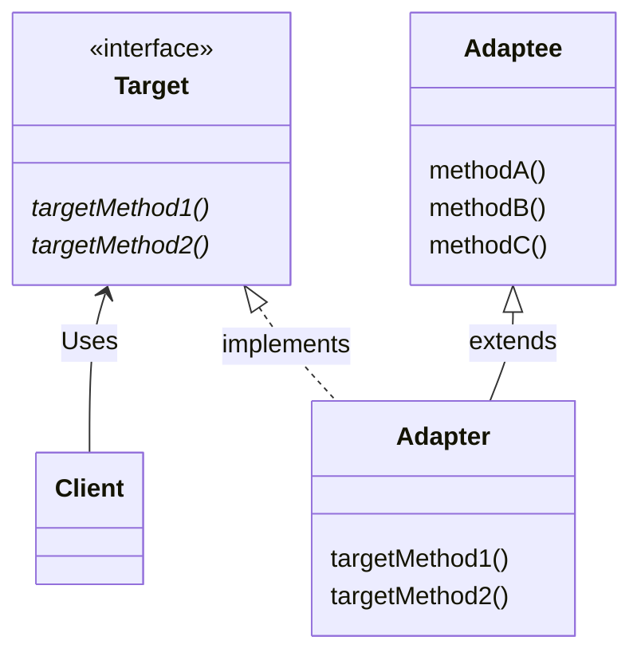
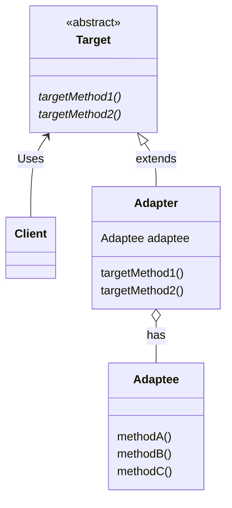

# Adapter 模式

在程序代码中，经常会出现现有的程序无法直接使用，需要做适当的交换之后才能使用的情况。**这种用于填补“现有的程序”和
“所需的程序”之间差异的设计模式就是 Adapter 模式**。

Adapter 模式也被称为 Wrapper 模式。Wrapper 有 “包装器”的意思，就像用精美的包装纸将普通商品包装成礼物那样，
替我们把某样东西包起来，使其能够用于其他用途的东西就被称为“包装器”或“适配器”

Adapter 模式有以下两种：

- 类适配器模式（使用继承的适配器）
- 对象适配器模式（使用委托的适配器）

# Adapter 模式中的登场角色
```text
1、Target（对象）
该角色负责定义所需的方法。以具体例子来说，即让笔记本电脑正常工作所需的直流 12 伏特电源。在示例程序中，
由 Print 接口（使用继承时）和 Print 类（使用委托时）扮演此角色、
2、Client（请求者）
该角色负责使用 Target 角色所定义的方法进行具体处理。以具体例子来说，即直流 12 伏特电源。在示例程序中，
由 Main 类扮演此角色
3、Adaptee（被适配）
注意不是 Adapter（适配）角色，而是 Adaptee（被适配）角色。Adaptee 是一个持有既定方法的角色。以具体例子
来说，即交流 100 伏特电源。在示例程序中，由 Banner 类扮演此角色。如果 Adaptee 角色中的方法与 Target 角色
中的方法相同（也就是说家庭使用的电压就是 12 伏特直流电压），那么就不需要接下来的 Adapter 角色了。
4、Adapter（适配器）
Adapter 模式的主角。使用 Adaptee 角色的方法来满足 Target 角色的需求，这就是 Adapter 模式的目的，也是 Adapter
角色的作用。以具体例子来说，Adapter 角色就是将交流 100 伏特电压转换为直流 12 伏特电压的适配器。在示例程序中，由
PrintBanner 类扮演这个角色。在类适配器模式中，Adapter 角色通过继承来使用 Adaptee 角色，而在对象适配器模式中，
Adapter 角色通过委托来使用 Adaptee 角色。 
```
# 类图对比
- 使用继承的适配器模式的类图

- 使用委托的适配器模式的类图


# 扩展思路的要点
## 什么时候使用 Adapter 模式
一定会有人认为“如果某个方法就是我们所需要的方法，那么直接在程序中使用不就可以了吗？为什么还要考虑使用使用
Adapter 模式呢？”，那么，究竟在什么时候使用 Adapter 模式呢？

很多时候，我们并非从零开始编程，经常会用到现有的类。特别是当现有的类已经被充分测试过了，Bug 很少，而且已经
被用于其他方法之中时，我们更愿意将这些类作为组件重复利用。

Adapter 模式会对现有的类进行适配，生成新的类。通过该模式可以很方便地创建我们需要的方法群。当出现 Bug 时，由于
我们很明确地知道 Bug 不在现有的类（Adaptee 角色）中，所以只需要调查扮演 Adapter 角色的类即可。这样一来，代码
问题的排查就会变得非常简单。

## 如果没有现成的代码
让现有的类适配新的接口（API）时，使用 Adapter 模式似乎是理所当然的。不过实际上，我们在让现有的类适配
新的接口时，常常会有“只要将这里稍微修改下就可以了”的想法，一不留神就会修改现有的代码。但是需要注意的是，
如果要对已经测试完毕的现有代码进行修改，就必须在修改后重新进行测试。

**使用 Adapter 模式可以在完全不改变现有代码的前提下使现有代码适配于新的接口（API）。此外，在 Adapter 模式
中，并非一定需要现成的代码。只要知道现有类的功能，就可以编写出新的类。**

## 版本升级与兼容性
软件的生命周期总是伴随着版本的升级，而在版本升级的时候经常会出现“与旧版本的兼容性”问题。如果能够完全抛弃旧版本，
那么软件的维护工作将会轻松得多，但是现实中往往无法这样做。这时，我们就可以使用 Adapter 模式使新旧版本兼容。

例如，假设我们今后只想维护新版本。这时可以让新版本扮演 Adaptee 角色，旧版本扮演 Target 角色。接着编写一个扮演
Adapter 角色的类，让它使用新版本的类来实现旧版本的类中的方法。

## 功能完全不同的类
当然，当 Adaptee 角色和 Target 角色的功能完全不同时，Adapter 模式是无法使用的。就如同我们无法用
交流 100 伏特电压让自来水管出水一样。

# 相关的设计模式

- Bridge 模式

Adapter 模式用于连接接口（API）不同的类，而 Bridge 模式则用于连接类的功能层次结构和实现层次结构。

- Decorator 模式

Adapter 模式用于填补不同接口（API）之间的缝隙，而 Decorator 模式则是在不改变接口（API）的前提下增加功能。
