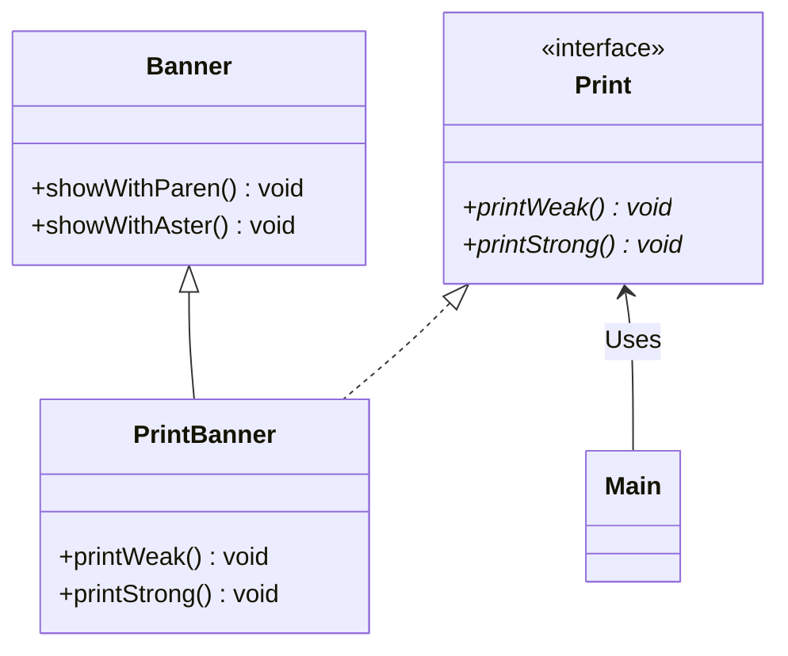

# 使用继承的适配器

如果像让额定工作电压是直流 12 伏特的笔记本电脑在交流 100 伏特的 AC 电源下工作，应该怎么做呢？通常我们会
使用 AC 适配器，将家庭用的交流 100 伏特电压转换为我们所需要的直流 12 伏特电压。这就是适配器的工作，它位
于实际情况与需求之间，填补二者之间的差异。

```
sample1 是一段使用继承的适配器是示例程序，它会将输入的字符串 str 输出为 (str) 或 *str*。

目前在 Banner 类中，有将字符串用括号括起来的 showWithParen 方法，和将字符串用星号括起
来的 showWithAster。我们假设这个 Banner 是类似上面提到的“交流 100 伏特”的“实际情况”

假设 Print 接口中声明了两种方法，即弱化字符串显示（加括号）的 printWeak 方法和强化字符串
显示（加星号）的 printStrong 方法。我们假设这个这个接口是类似于上面提到的“直流 12 伏特”的
“需求” 。

现在要做的事就是使用 Banner 类编写一个实现了 Print 接口的类，也就是说要做一个将 “交流 100 伏特”
转换成“直流 12 伏特”的适配器。

扮演适配器角色的是 PrintBanner 类。该类继承了 Banner 类并实现了 “需求”——Print接口。PrintBanner
类使用 showWithParen 方法实现了 printWeak，使用 showWithAster 实现了 printStrong。这样，PrintBanner
类就具有适配器的功能了。
```


|          | 电源的比喻    | 示例                                                |
| ---------- | --------------- | ----------------------------------------------------- |
| 实际情况 | 交流 100 伏特 | Banner 类（showWithParen、showWithAster）           |
| 变换装置 | 适配器        | PrintBanner 类 （extends Banner，implements Print） |
| 需求     | 直流 12 伏特  | Print 接口（printWeak、printStrong）                |

# 类图



# 小结
> ```text
> 对于 Main 类的代码来说，Banner 类、showWithParen 方法和 showWithAster 方法被完全隐藏起来了。这
> 就好像笔记本只要在直流电 12 伏特下就能正常工作，但它不知道这 12 伏特的电压是由适配器将 100 伏特交流电
> 转化而成的。
>
> Main 类并不知道 PrintBanner 类是如何实现的。这样就可以在不用对 Main 类进行修改的情况下改变 PrintBanner 类的具体实现。
>```
