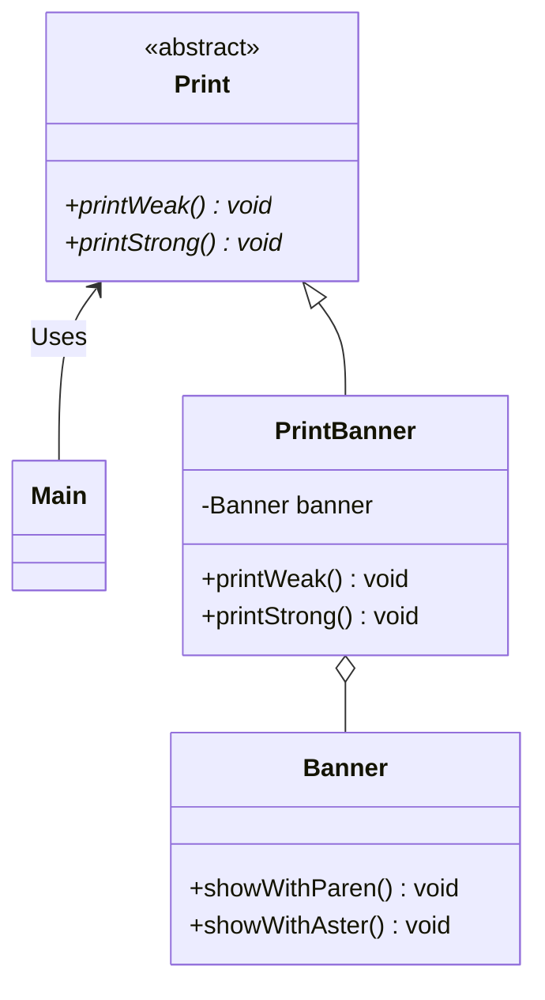

# 使用委托的适配器

sample1 使用“继承”实现适配器，而 sample2 使用“委托”来实现适配器。什么叫委托呢？

**“委托”说得通俗点就是“交给其他人”。在 Java 中，委托就是指将某个方法中的实际处理交给其他实例的方法**

```
    在 sample2 中，我们假设 Print 不是接口，而是抽象类。我们打算利用 Banner 类实现一个类，
该类的方法和Print 类的方法相同。由于 Java 中不存在多继承，因此我们无法将 PrintBanner 类
分别定义为 Print 类和 Banner 类的子类。
    PrintBanner 类的 banner 字段中保存了 Banner 类的实例。该实例是在 PrintBanner 类的构造
函数中生成的。然后，printWeak 方法和 printStrong 方法会通过 banner 字段调用 Banner 类的 showWithParent
和 showWithAster 方法。
    与 sample1 的代码中调用了从父类继承的 showWithParent 方法和 showWithAster 方法不同，这次我们
通过字段来调用者两个方法。
    这样就形成了一种委托关系。当 PrintBanner 类的 printWeak 被调用的时候，并不是 PrintBanner 类
自己处理，而是将处理交给其他实例（Banner 类的实例）的showWithParen 方法
```
# 类图
