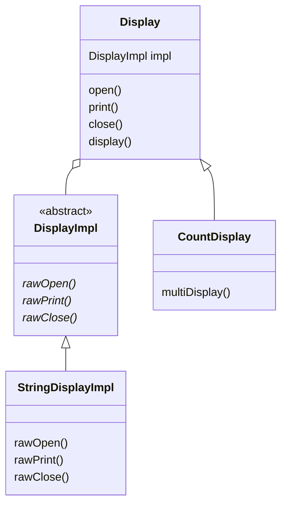
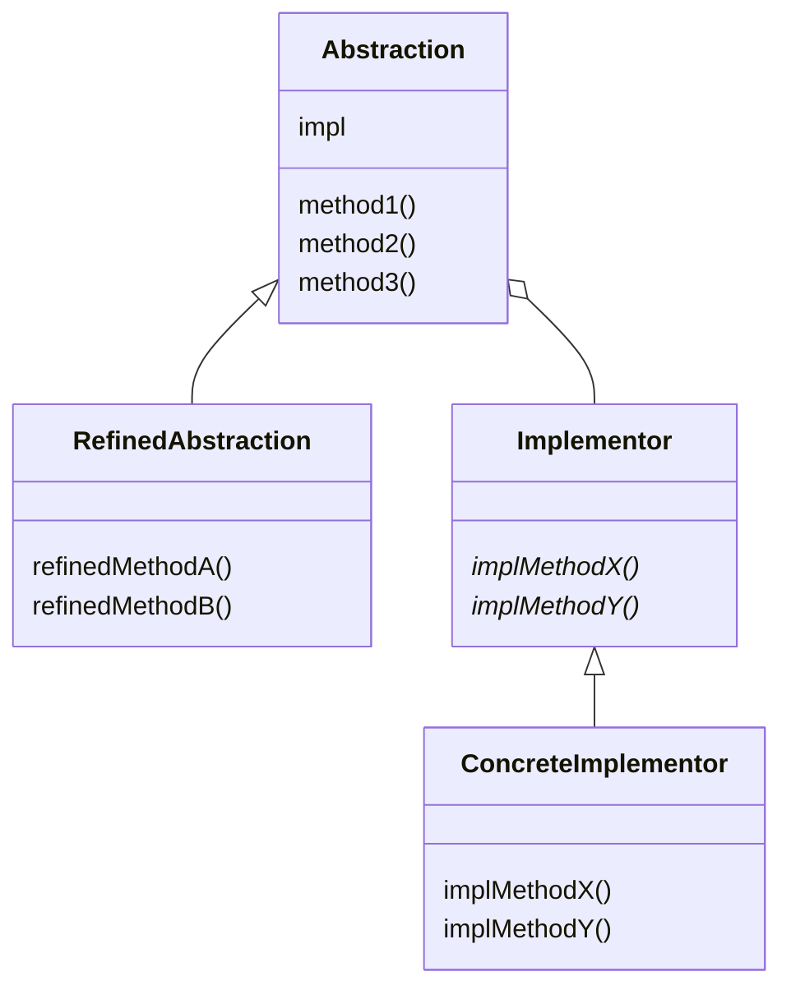

# Bridge 模式
Bridge 的意思是 “桥梁”。就像在现实世界中，桥梁的功能时将河流的两侧连接起来一样，Bridge 模式的作用也是将两样东西连接起来，
它们分别是**类的功能层次结构**和**类的实现层次结构**。
Bridge 模式的作用是在 “类的功能层次结构”与“类的实现层次结构”之间搭建桥梁。因此我们需要先了解一下这两种层次结构。
这是因为如果不能理解河流两边的土地，也就无法理解桥梁存在的意义了。
- 类的功能层次结构
- 类的实现层次结构
## 希望增加新的功能时
假设现在有一个类 Something。当我们想在 Something 中增加新功能时（想增加一个具体方法时），会编写一个 Something 类的子类（派生类），
即 SomethingGood 类。这样就构成了一个小小的类层次结构。
```text
Something
    |————SomethingGood
```
这就是为了增加新功能而产生的层次结构。
- 父类具有基本功能
- 在子类中增加新的功能

**以上这种层次结构被称为“类的功能层次结构”**

如果我们要继续在 SomethingGood 类的基础上增加新的功能，该怎么办呢？这时，我们可以同样地编写一个 SomethingGood 
类的子类，即 SomethingBetter 类。这样，类的层次结构就加深了。

```text
Something
    |————SomethingGood
            |————SomethingBetter
```
**当要增加新的功能时，我们可以从各个层次的类中找出最符合自己需求的类，然后以它为父类编写子类，并在子类中增加新的功能。
这就是“类的功能层次结构”**。

## 希望增加新的实现时
在 Template Method 模式中，我们学习了抽象类的作用。抽象类声明了一些抽象方法，定义了接口（API），然后子类负责去实现这些抽象方法。
父类的任务时通过声明抽象方法的方式定义接口（API），而子类的任务是实现抽象方法。正是由于父类和子类的这种任务分担，我们才可以编写出
具有高可替代性的类。

这里其实也存在层次结构。例如，当子类 ConcreteClass 实现了父类 AbstractClass 类的抽象方法时，它们之间就构成了一个小小的层次结构。
```text
AbstractClass
        |————ConcreteClass
```
但是，这里的类的层次结构并非用于新增功能，也就是说，这种层次结构并非用于方便我们增加新的方法。它的真正作用是帮助我们实现下面这样的任务分担。
- **父类通过声明抽象方法来定义接口（API）**
- **子类通过实现具体方法来实现接口（API）**

这种层次结构被称为 **“类的实现层次结构”**

当我们以其他方式实现 AbstractClass 时，例如要实现一个 AnotherConcreteClass 时，类的层次结构就会变成
```text
AbstractClass
        |————ConcreteClass
        |————AnotherConcreteClass 
```
## 类的层次结构的混杂与分离
**当我们想要编写子类的时候，就需要先确认自己的意图：“我是要增加功能呢？还是要增加实现呢？”**。当类的层次结构只有一层时，
功能层次结构与实现层次结构是混杂在一个层次结构中的。这样很容易使类的层次结构变得复杂，也难以透彻地理解类的层次结构。
因为自己难以确定究竟应该在类的哪一个层次结构中去增加子类。

因此，我们需要将 “类的功能层次结构” 与 “类的实现层次结构” 分离为两个独立的类层次结构。当然，如果只是简单地将它们分开，
二者之间必然会缺少联系。所以我们还需要在它们之间搭建一座桥梁。

# 示例程序
示例程序的功能是 “显示一些东西”

## 类的一览表

| 在 Bridge 的哪一侧 | 类名                     | 说明                 |
|---------------|------------------------|--------------------|
| 类的功能层次结构      | Display                | 负责“显示”的类           |
| 类的功能层次结构      | CountDisplay           | 增加了“只显示规定次数”这一功能的类 |
| 类的实现层次结构      | DisplayImpl            | 负责“显示”的类           |
| 类的实现层次结构      | StringDisplayImplement | “用字符串显示”的类         |
|               | Main                   | 测试程序行为的类           |


## 示例程序的类图


# Bridge 模式中的登场角色
- Abstraction（抽象化）

该角色位于 “类的功能层次结构” 的最上层。它使用 Implementor 角色的方法定义了基本的功能。
该角色中保存了 Implementor 角色的实例。在示例程序中，由 Display 类扮演此角色。
- RefinedAbstraction（改善后的抽象化）

在 Abstract 角色的基础上增加了新功能的角色。在示例程序中，由 CountDisplay 类扮演此角色。
- Implementor（实现者）

该角色位于 “类的实现层次结构” 的最上层。它定义了用于实现 Abstraction 角色的接口（API）的方法。
在示例程序中，由 DisplayImpl 类扮演此角色。
- ConcreteImplementor（具体实现者）

该角色负责实现 Implementor 角色中定义的接口（API）。在示例程序中，由 StringDisplayImpl 类扮演此角色。

Bridge 的类图如下， Abstraction 和 RefinedAbstraction 类构成了 “类的功能层次结构”。
Implementor 和 ConcreteImplementor 构成了 ”类的实现层次结构“。**类的两个层次结构之间的桥梁是 impl 字段。**


# 扩展思路的要点
## 分开后更容易扩展
Bridge 模式的特征就是就是将 “类的功能层次结构” 与 “类的实现层次结构” 分离开了。将类的这两个层次结构分离开有利于独立地对它们进行扩展。

当想要增加功能时，只需要在 “类的功能层次结构” 一侧增加类即可，不必对 “类的实现层次结构” 做任何修改。而且，**增加后的功能可以被 “所有的实现” 使用。**

例如，我们可以将 “类的功能层次结构” 应用于操作系统上。如果我们将某个程序中依赖于操作系统的部分划分为 Window 版、Mac 版、Unix 版，
那么我们就可以用 Bridge 模式中的 “类的实现层次结构” 来表现这些依赖于操作系统的部分。也就是说，我们需要编写一个定义这些操作系统的共同接口（API）
的 Implementor 角色，然后编写 Windows 版、Mac 版、Unix 版的 3 个 ConcreteImplementor 角色。这样一来，无论在 “类的功能层次结构”
中增加多少个功能，它们都可以工作在这 3 个操作系统上。

## 继承是强关联，委托时弱关联

虽然使用 “继承” 很容易扩展类，但是类之间也形成了一种强关联关系。例如，在下面的代码中，SomethingGood 类是 Something 的子类，
但只要不修改代码，就无法改变这种关系。因此可以说它们之间形成了一种强关联关系。
```text
class SomethingGood extends Something {
    
}
```
**如果想很轻松地改变类之间的关系，使用继承就不适合了，因为每次改变类之间的关系时都需要修改程序。这时，我们可以使用 “委托” 来代替 “继承” 关系。**

示例程序的 Display 类中使用了 “委托”。Display 类的 impl 字段保存了 DisplayImpl 的实例。这样，类的任务就发生了转移。
- 调用 open 方法会调用 impl.rawOpen() 方法
- 调用 print 方法会调用 impl.rawPrint() 方法
- 调用 close 方法会调用 impl.rawClose() 方法

**也就是说，当其他类要求 Display 类 “工作” 的时候，Display 类并非自己工作，而是将工作 “交给 impl”，这就是 “委托”。**

继承时强关联关系，但委托是弱关联关系。这是因为只有 Display 类的实例生成时，才与作为参数被传入的类构成关联。例如，在示例程序中，
当 Main 类生成 Display 类和 CountDisplay 类的实例时，才将 StringDisplayImpl 的实例作为参数传递给 Display 类和 CountDisplay 类。

如果我们不传递 StringDisplayImpl 类的实例，而是将其他 ConcreteImplementor 角色的实例传递给 Display 类和 CountDisplay 类，
就能很容易地改变实现。这时，发生变化的代码只有 Main 类，Display 类和 DisplayImpl 类则不需要做任何修改。

# 相关的设计模式

- Template Method 模式

在 Template Method 中使用了 “类的实现层次结构”。父类调用抽象方法，而子类实现抽象方法。

- Abstract Factory 模式

为了能够根据需求设计出良好的 ConcreteImplementor 角色，有时我们会使用 Abstract Factory 模式

- Adapter 模式

使用 Bridge 模式可以达到类的功能层次结构与类的实现层次结构分离的目的，并在此基础上是这些层次结合起来。
而使用 Adapter 模式则可以结合那些功能上相似但是接口（API）不同的类。

