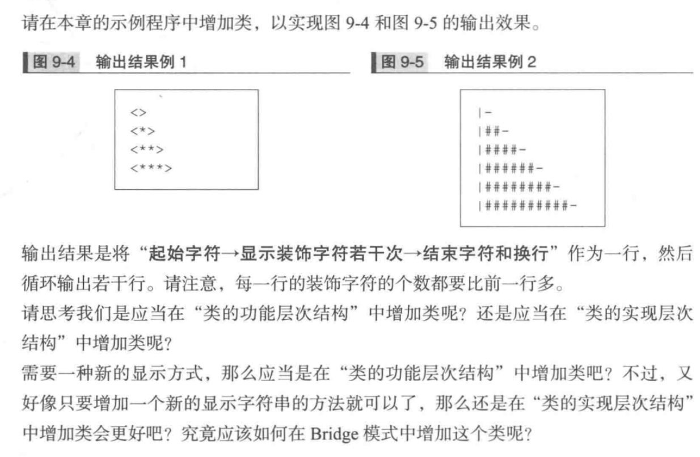

# 习题 9-3

习题让我们将一个类同时加入到类的功能层次结构中和类的实现层次结构中。但是，如果我们将要**增加的类从功能上和实现上分为两个类，
将“功能类”加入到类的功能层次结构中，将“实现类”加入类的实现层次结构中，Bridge 模式就非常适用于这种场景了**。而且，采用这样
的实现方法，“功能类”还可以被其他类（CountDisplay 类和 RandomCountDisplay 类）使用，“实现类”也可以在其他类（StringDisplayImpl 类
和 FileDisplayImpl 类）使用。

因此，我们将系统中的类从实现和功能上分为以下两个类：
- IncreaseDisplay 类：表示逐渐增加显示次数的 “功能上” 的类
- CharDisplayImplement 类：表示以字符显示的 “实现上” 的类