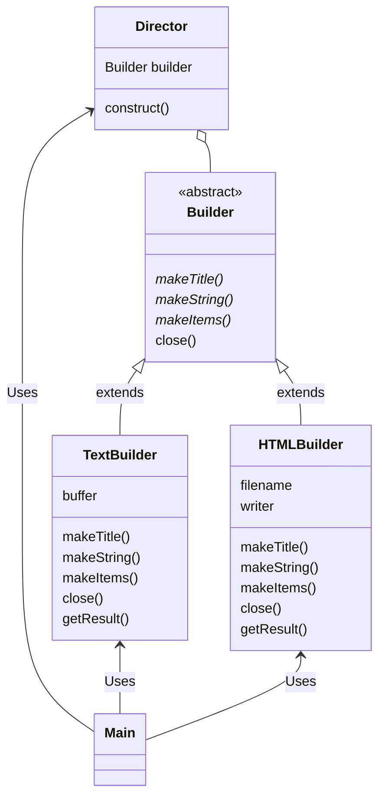
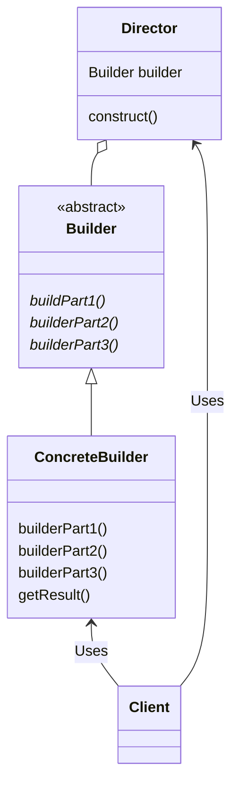
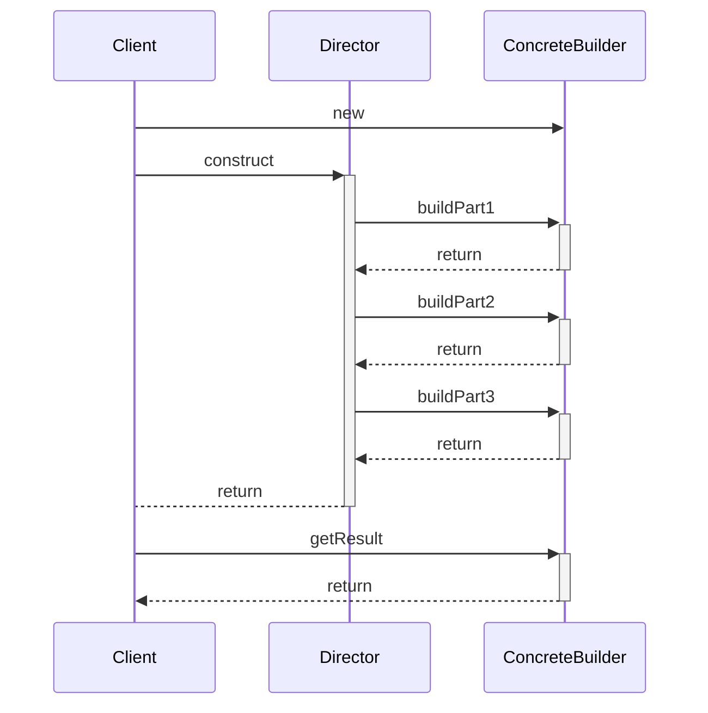

# Builder 模式
大都市中林立着许多高楼大厦，这些高楼大厦都是具有建筑结构的大型建筑。通常，建造和构建这种具有建筑结构的大型物体在英文中称为 Build。

在建造大楼时，需要先打捞地基，搭建框架，然后自下而上地一层一层盖起来。通常，在建造这种具有复杂结构的物体时，很难一气呵成。
我们需要首先建造组成这个物体的各个部分，然后分阶段将它们组装起来。而**本章就是学习用于组装具有复杂结构的实例的 Builder 模式**。

# 示例程序
## 功能介绍
示例程序是一段使用 Builder 模式编写“文档”的程序。这里编写出的文档具有以下结构。

- **含有一个标题**
- **含有几个字符串**
- **含有条目项目**

Builder 类中定义了决定文档结构的方法，然后 Director 类使用该方法编写一个具体的文档。Builder 是抽象类，它并没有进行任何实际的处理，
仅仅声明了抽象方法。Builder 类的子类决定了用来编写文档的具体处理。

在示例程序中，我们定义了以下 Builder 类的子类。
- **TextBuilder 类：使用纯文本（普通字符串）编写文档**
- **HTMLBuilder 类：使用 HTML 编写文档**

Director 使用 TextBuilder 类时可以编写纯文本文档；使用 HTMLBuilder 类时可以编写 HTML 文档

## 类的一览表

| 类名          | 说明                 |
|-------------|--------------------|
| Builder     | 定义了决定文档结构的方法的抽象类   |
| Director    | 编写 1 个文档的类         |
| TextBuilder | 使用纯文本（普通字符串）编写文档的类 |
| HTMLBuilder | 使用 HTML 编写文档的类     |
| Main        | 测试程序行为的类           |

## 示例程序的类图

# Builder 模式中的登场角色

- Builder（建造者）

Builder 角色负责定义用于生成实例的接口（API）。Builder 角色中准备了用于生成实例的方法。在示例程序中，由 Builder 类扮演此角色。

- ConcreteBuilder（具体的建造者）

ConcreteBuilder 角色是负责实现 Builder 角色的抽象方法（API）的类。这里定义了在生成实例时实际被调用的方法。
此外，在 ConcreteBuilder角色中还定义了获取最终生成结果的方法。在示例程序中，由 TextBuilder 类和 HTMLBuilder 类扮演此角色。

- Director（监工）

Director 角色负责使用 Builder 角色的抽象方法（API）来生成实例。它并不依赖于 ConcreteBuilder 角色。
为了确保无论 ConcreteBuilder 角色是如何被定义的，Director 角色都能正常工作。它只调用在 Builder 角色中被定义的方法。
在示例程序中，由 Director 类扮演此角色。

- Client （使用者）

该角色使用了 Builder 模式，在示例程序中，由 Main 类扮演此角色。

## Builder 模式的类图

## Builder 模式的序列图

# 相关的设计模式
- Template Method 模式

在 Builder 模式中，Director 角色控制 Builder 角色。在 Template Method 模式中，父类控制子类。（注意，
这里的控制指的是方法的调用顺序的控制。在 Builder 模式中， Director 决定了 Builder 角色中方法的调用顺序，
而在 Template Method 模式中，父类决定了子类方法的调用顺序）

- Composite 模式

有些情况下 Builder 模式生成的实例构成了 Composite 模式。

- Abstract Factory 模式

Builder 模式和 Abstract Factory 模式都用于生成复杂的实例。

- Facade 模式

**在 Builder 模式中，Director 角色通过组合 Builder 角色中的复杂方法向外部提供可以简单生成实例的接口（API），
即示例程序中的 construct 方法**。Facade 模式 中的 Facade 角色则是通过组合内部模块向外部提供可以简单的接口（API）。

# 拓展思路的要点
## 谁知道什么
在面向对象编程中，“谁知道什么”是非常重要的。也就是说，**我们需要在编程时注意哪个类可以使用哪个方法以及使用这个方法到底好不好**。

以示例程序为例，**Main 类并不知道（没有调用）Builder 类，它只是调用了 Direct 类的 construct 方法。这样，Director 类就会开始工作
（Main 类对此一无所知），并完成文档的编写**。

**另一方面，Director 类知道 Builder 类，它调用 Builder 类的方法来编写文档，但是它并不知道它“真正”使用的是哪个类。也就是说它并不知道它
所使用的类到底是 TextBuilder 类，HTMLBuilder 类还是其他 Builder 类的子类**。不过也没有必要知道，因为 Director 类只使用了 Builder 
类的方法，而 Builder 类的子类都已经实现了那些方法。

**“只有不知道子类才能替换”**。无论是将 TextBuilder 的实例传递给 Director，还是将 HTMLBuilder 类的实例传递给
Director，它都可以正常工作，**原因正是 Director 类不知道 Builder 类的具体的子类**。

正是因为不知道才能够替换，正是因为可以替换，组件才具有高价值，因此，我们必须时刻关注这种 “可替换性”。

## 设计时能够决定的事情和不能决定的事情（重点！！！）
**在 Builder 类中，需要声明编辑文档（实现功能）所必需的所有方法。Director 类中使用的方法都是 Builder 类提供的。
因此，在 Builder 类中应当定义哪些方法是非常重要的**。而且，Builder 类还必须能够应对将来子类可能增加的需求。
在示例程序中，只是编写了支持纯文本文档的子类和支持 HTML 文件的子类。但是将来可能还会希望能够编写其他形式（例如 XXXX 形式）的文档。
虽然在我们设计类的时候，无法准确地预测到将来可能发生的变化。但是，我们还是有必要让设计出的类能够尽可能灵活地应对近期可能发生的变化。

## 代码的阅读方法和修改方法（重点！！！阅读项目源码的时候深有体会）
**在编程时，虽然有时需要从零开始编写代码，但更多时候我们都是在现有代码的基础上进行增加和修改。这时，我们需要先阅读现有代码。
不过，只是阅读抽象类的代码是无法获取很多信息的（虽然可以从方法名中获得线索）**。

以示例程序为例，我们即使理解了 Builder 抽象类，也无法理解程序整体。至少必须在阅读了 Director 的代码后才能理解 
Builder 类的使用方法（Builder 类的方法的调用方法）。然后再去看看 TextBuilder 类和 HTMLBuilder 类的代码，
就可以明白 Builder 类的方法后具体会进行什么样的处理。

如果没有理解各个类的角色就动手增加和修改代码，在判断应该修改哪个类时，就会很容易出错。例如，如果修改 Builder 类，那么就会对
Director 类中调用 Builder 类方法的地方和 Builder 类的子类产生影响。或是如果不小心修改了 Director 类，在其内部调用了 TextBuilder
类的特有的方法，则会导致其失去可复用组件的独立性，而且当将子类替换为 HTMLBuilder 时，程序可能会无法正常工作。

