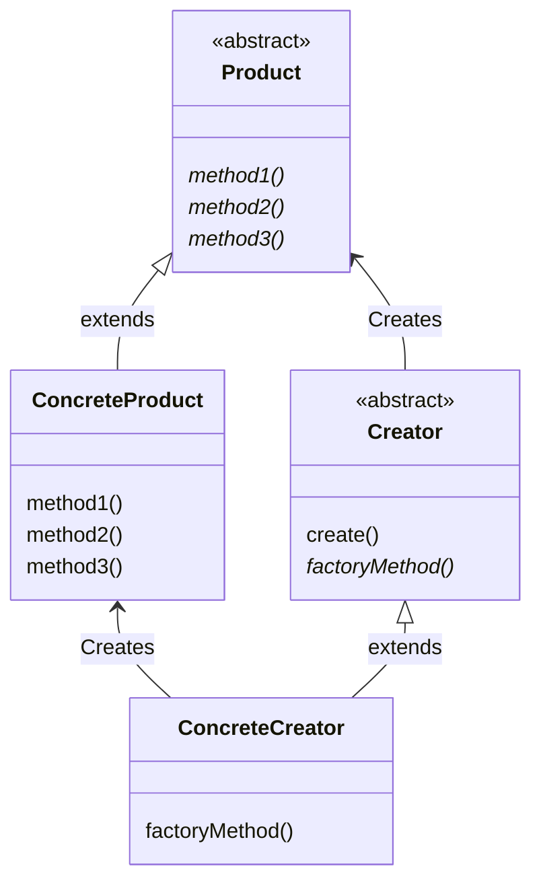

# Factory Method 模式
在 Template Method 模式中，我们在父类中规定处理的流程，在子类中实现具体的处理。如果我们将该模式用于生成实例，
它就演变成了 Factory Method 模式。

**Factory 有“工厂“的意思，用 Template Method 模式来构建生成实例的工厂，这就是 Factory Method 模式。**

在 Factory Method 模式中，父类决定实例的生成方式，但并不决定所要生成的具体的类，具体的处理全部交给子类负责。
这样就可以将生成实例的框架（framework）和实际负责生成实例的类解耦。

# 类图
首先简单介绍一下 Factory Method 模式的示例程序。这段示例程序的作用是制作身份证（id card），它有 5 个类。

Product 类和 Factory 类属于 framework 包，这两个类组成生成实例的框架

IDCard 类和 IDCardFactory 类负责实际的加工处理，它们属于 idcard 包

Main 类是用于测试程序行为的类

| 包         | 类名            | 说明                                                       |
|-----------|---------------|----------------------------------------------------------|
| framework | Product       | 只定义抽象方法 use 的抽象类                                         |
| framework | Factory       | 定义了 createProduct、registerProduct 抽象方法和实现了 create 方法的抽象类 |
| idcard    | IDCard        | 实现了 use 方法的类                                             |
| idcard    | IDCardFactory | 实现了 createProduct、registerProduct 方法的类                   |
| sample1   | Main          | 测试程序行为的类                                                 |



# Factory Method 模式中的登场角色

在 Factory Method 模式中有以下登场角色。通过上面的类图，我们可以知道父类（框架）这一方的 Creator 角色和 Product
角色的关系与子类（具体实现）这一方的 ConcreteCreator 角色和 ConcreteProduct 角色的关系是平行的。

- Product（产品）

Product 角色属于框架这一方，是一个抽象类。它定义了在 Factory Method 模式中生成的那些实例所持有的接口（API），
但具体的处理则由子类 ConcreteProduct 角色决定。在 sample1 中，由 Product 类扮演此角色。

- Creator（创建者）

Creator 角色属于框架这一方，它是负责生成 Product 角色的抽象类，但具体的处理则由子类 ConcreteCreator决定。
在 sample1 中，由 Factory 类扮演此角色。

Creator 角色对于实际负责生成实例的 ConcreteCreator 角色一无所知，它唯一知道的就是，只要调用 Product 角色和生成
实例的方法（上面类图中的 factoryMethod 方法），就可以生成 Product 的实例。在 sample1 中，createProduct 方法
就是用于生成实例的方法。**不用 new 关键字来生成实例，而是调用生成实例的专用方法（即 createProduct）来生成实例，
这样就可以防止父类与其他具体类耦合。**

- ConcreteProduct（具体的产品）

ConcreteProduct 角色属于具体加工这一方，它决定了具体的产品。在 sample1 中，由 IDCard 类扮演此角色。

- ConcreteCreator（具体的创建者）

Concrete 角色属于具体加工这一方，它负责生成具体的产品。在 sample1 中，由 IDCardFactory 类扮演此角色。

# 扩展思路要点
## 框架与具体加工
至此，我们分别学习 “框架” 与 “具体加工” 这两方面的内容。它们分别被封装在 framework 包和 idcard 包中。

假如说，让我们用相同的 “框架” 创建出其他具体的 “产品” 和 “工厂”。例如，我们这次要创建表示电视机的类 Television
和表示电视机工厂的类 TelevisionFactory。这时，我们只需直接 import framework 包就可以编写 television 包。

请注意**我们没有修改，也根本没有必要修改 framework 包中的任何内容，就可以创建出其他的 “产品” 和 “工厂”。**

我们可以看一下，在 framework 包中我们并没有引入 idcard 包。在 Product 类和 Factory 类中，并没有出现 IDCard 和
IDCardFactory 等具体类的名字。因此，就算使用已有的框架生成全新的类时，也完全不需要对 framework 进行修改，即不需要
“将 television 包引入到 framework 包中”。我们称之为“framework 包不依赖于 idcard 包”。

## 生成实例——方法的三种实现方式
在 sample1 中，Factory 类的 createProduct 方法是抽象方法，也就是说需要在子类中实现该方法。

createProduct 方法的实现方式一般有以下三种。

- 指定其为抽象方法

指定其为抽象方法。一旦将 createProduct 指定为抽象方法后，子类就必须实现该方法。如果子类不实现该方法，
编译器就会报告编译时异常，这也是 sample1 中所采用的方式。
```text
abstract class Factory {
    public abstract Product createProduct(String name);
    ...
}
```

- 为其实现默认处理

为其实现默认处理。实现默认处理后，如果子类没有实现该方法，将进行默认处理。
```text
abstract class Factory {
    public abstract Product createProduct(String name) {
        return new Product(name);
    }
    ...
}
```
不过，这时是使用 new 关键字创建实例的，因此就不能将 Product 类定义为抽象类。

- 在其中抛出异常

在其中抛出异常的方法。createProduct 方法的默认处理为抛出异常，这样一来，
如果未在子类中实现该方法，程序就会出现运行时异常（报错，告知开发人员没有实现 createProduct 方法）。
```text
abstract class Factory {
    public abstract Product createProduct(String name) {
        throw new FactoryMethodRuntimeException();
    }
    ...
}
```
不过，需要另外编写 FactoryMethodRuntimeException 异常类。

## 使用模式与开发人员之间的沟通

无论是前面学习的 Template Method 模式，还是这次学习的 Factory Method 模式，在实际工作中使用时，都会让我们感觉到比较困难。
这是因为，**如果仅阅读一个类的代码，是很难理解这个类的行为的。必须要理解父类中所定义的处理的框架和它里面所使用的抽象方法，
然后阅读代码，了解这些抽象方法在子类中的实现才行**。

# 相关的设计模式

- Template Method 模式

Factory Method 模式就是 Template Method 模式的典型应用。在 sample1 中，Factory 类中的 create 方法就是模板方法。
- Singleton 模式

在多数情况下我们都可以将 Singleton 模式用于扮演 Creator 角色（或是 ConcreteCreator 角色）的类。
这是因为在程序中没有必要存在多个 Creator 角色（或是 ConcreteCreator 角色）的实例。不过在示例程序中，我们并没有使用 Singleton 模式。
- Composite 模式

有时候可以将 Composite 模式用于 Product 角色（或是 ConcreteProduct角色）。
- Iterator 模式

有时，在 Iterator 模式中使用 iterator 方法生成 Iterator 的实例时会使用 Factory Method 模式。
