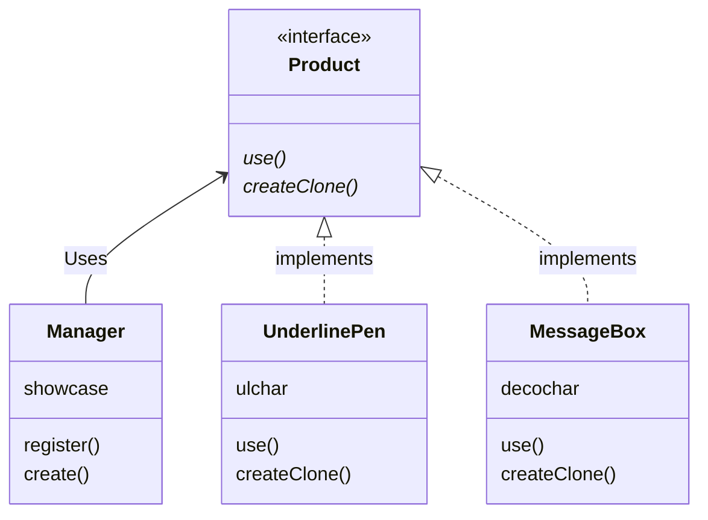
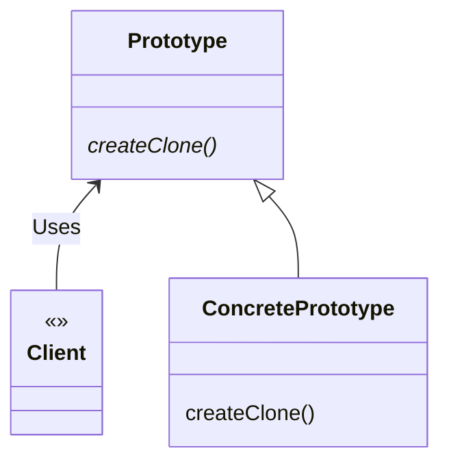

# Prototype 模式
我们通常会使用以下方式生成 Something 类的实例。

`new Something()`

在 Java 中，**我们可以使用 new 关键字指定类名来生成类的实例。像这样使用 new 来生成实例时，是必须指定类名的。
但是，在开发过程中，有时候也会有“在不指定类名的前提下生成实例”的需求**。例如，在以下情况下，我们就不能根据类来
生成实例，而要**根据现有的实例来生成新的实例**。

**（1）对象种类繁多，无法将它们整合到一个类中时**

**第一种情况是需要处理的对象太多，如果将它们分别作为一个类，必须要编写很多个类文件。**

**（2）难以根据类生成实例时**

**第二种情况是生成实例的过程太过复杂，很难根据类来生成实例**。例如，我们假设这里有一个实例，即表示用户在图形编辑器中
使用鼠标制作出的图形的实例。想在程序中创建这样的实例是非常困难的。通常，在想生成一个和之前用户通过操作所创建出的
实例完全一样的实例的时候，我们会实现将用户通过操作所创建出的实例保存起来，然后在需要时通过复制来生成新的实例。

**（3）想解耦框架与生成的实例时**

**第三种情况是想要让生成实例的框架不依赖于具体的类**。**这时，不能指定类名来生成实例，而要事先“注册”一个“原型”实例，
然后通过复制该实例来生成新的实例。**

根据实例生成实例与使用复印机复印文档相类似。即使不知道原来的文档中的内容，我们也可以使用复印机复制出完全相同的文档，无论多少份都行。

在本章中，我们将要学习不根据类来生成实例，而是根据实例来生成新实例的 Prototype 模式。Prototype 有“原型”，“模型”的意思。
在设计模式中，它是指根据实例原型、实例模型来生成新的实例。在 Java 语言中，我们可以使用 clone 创建出实例的副本。在本章中，
我们将学习 clone 方法与 Cloneable 接口的使用方法。

# 示例程序类图

sample1 的功能时将字符串放入方框中显示出来或是加上下划线显示出来。

Product 接口和 Manager 类属于 framework 包，负责复制实例。虽然 Manager 类会调用 createClone 方法，但是对于具体要复制哪个类一无所知。
不过，只要是实现了 Product 接口的类，调用它的 createClone 方法就可以复制出新的实例。

MessageBox 类和 UnderlinePen 类是两个实现了 Product 接口的类。只要事先将这两个类“注册”到 Manager 类中，就可以随时复制新的实例。

---

请注意，在 Product 接口和 Manager 类的代码中完全没有出现 MessageBox 类和 UnderlinePen 类的名字，这也意味着我们可以独立地修改
Product 和 Manager，不受 MessageBox 类和 UnderlinePen 类的影响。**这是非常重要的，因为一旦在类中使用到了别的类名，就意味着该类与
其他类紧密地耦合在了一起。在 Manager 类中，并没有写明具体的类名，仅仅使用了 Product 这个接口名。也就是说，Product 接口成为了连接
Manager 类个其他具体类之间的桥梁。**

MessageBox 类中的 createClone 方法用于复制自己。它内部所调用的 clone 方法是 Java 语言中定义的方法，用于复制自己。
在进行复制时，原来实例中的字段的值也会被复制到新的实例中。**我们之所以可以调用 clone 方法进行复制，仅仅是因为该类实现了
java.lang.Cloneable 接口。如果没有实现这个接口，在运行时程序将会抛出 CloneNotSupportedException 异常，
因此必须使用 try...catch 语句块捕获这个异常。此外，需要注意的是，java.lang.Cloneable 接口只是起到告诉程序可以调用
clone 方法的作用，它自身并没有定义任何方法**。**只有类自己（或是它的子类）能够调用 clone 方法。当其他类要求复制实例时，
必须先调用 createClone 这样的方法，然后在该方法内部再调用 clone 方法**。

| 包         | 类名           | 说明                                            |
|-----------|--------------|-----------------------------------------------|
| framework | Product      | 声明了抽象方法 use 和 createClone 的接口                 |
| framework | Manager      | 调用了 createClone 方法复制实例的类                      |
| sample1   | MessageBox   | 将字符串放入方框中并使其显示出来的类。实现了 use 方法和 createClone 方法 |
| sample1   | UnderlinePen | 将字符串加上下划线并使其显示出来的类。实现了 use 方法和 createClone 方法 |
| sample1   | Main         | 测试程序行为的类                                      |

# Prototype 模式中的登场角色
- Prototype（原型）

Prototype 角色负责定义用于复制现有实例来生成新实例的方法。在示例程序中，由 Product 接口扮演此角色。

- ConcretePrototype（具体的原型）

ConcretePrototype 角色负责实现复制现有实例并生成新实例的方法。在示例程序中，由 MessageBox 类和 UnderlinePen 类扮演此角色

- Client（使用者）

Client 角色负责使用复制实例的方法生成新的实例。在示例程序中，由 Manager 类扮演此角色。

# 扩展思路的要点
## 不能根据类来生成实例吗
大家在初学 Prototype 模式时应该会感觉到迷茫，既然是要创建新的实例，直接用 `new SomeClass()` 不就好了吗？为什么还需要 Prototype 模式呢？
下面我们以本示例程序为例，来谈谈这个问题。

**（1）对象种类繁多，无法将它们整合到一个类中时**

在示例程序中，一共出现了如下 3 种样式
- 使用 `~` 为字符串添加下划线
- 使用 `*` 为字符串添加边框
- 使用 `/` 为字符串添加边框

本示例程序比较简单，只生成了 3 种样式，不过只要想做，无论多少种样式都可以生成。但是我们可以思考一下，如果将每种样式都编写为一个类，
类的数量将会非常庞大，源程序的管理也就会变得非常困难。

**（2）难以根据类生成实例时**

本例中感觉不到这一点。大家可以试想一下开发一个用鼠标进行操作，类似图形编辑器的应用程序。假设我们想生成一个和用户通过一系列鼠标操作所
创建出来的实例完全一样的实例。这个时候，与根据类来生成实例相比，直接根据实例来生成实例要简单得多。

**（3）想解耦框架与生成的实例时**

在示例程序中，我们将复制（clone）实例的部分封装在 framework 包中。

在 Manager 类的 create 方法中，我们并没有使用类名，取而代之使用了 “strong message” 和 “slash box” 等字符串为生成的实例命名。
在于 Java 语言自带的生成实例的 new Something() 方式相比，这种方式具有更好的通用性，而且将框架从类名的束缚中解脱出来了。

## 类名是束缚吗
话说回来，**在源程序中使用类名到底会有什么问题呢？在代码中出现要使用的类的名字不是理所当然的吗？**

**我们可以回想一下面向对象编程的目标之一，即 “作为组件复用”**。在代码中出现要使用的类的名字并非总是坏事。不过，
**一旦在代码中出现要使用的类的名字，就无法与该类分离开，也就无法实现复用**。当然可以通过替换源代码或是改变类名来解决这个问题。
但是，此处说的“作为组件复用”中不包括替换源代码。以 Java 来说，重要的是当手边只有 class 文件（.class）时，该类能够被复用。
**即使没有 Java 文件（.java）也能复用该类才是关键。**

**总而言之，当多个类必须紧密结合时，代码中出现这些类的名字是没有问题的。但是如果那些需要被独立出来作为组件复用的类的名字出现在代码中，那就有问题了。**

# 相关的设计模式

- Flyweight 模式

使用 Prototype 模式可生成一个与当前实例的状态完全相同的实例。而使用 Flyweight 模式可以在不同的地方使用同一个实例。

- Memento 模式

使用 Prototype 模式可生成一个与当前实例的状态完全相同的实例。而使用 Memento 模式可以保存当前实例的状态，以实现快照和撤销功能。

- Composite 模式以及 Decorator 模式

经常使用 Composite 模式和 Decorator 模式时，需要能够动态地创建复杂结构的实例。这时可以使用 Prototype 模式，
以帮助我们方便地生成实例。

- Command 模式

想要复制 Command 模式中出现的命令时，可以使用 Prototype 模式。

# 延伸阅读：clone 方法和 java.lang.Cloneable 接口

## Java 语言的 clone

Java 语言为我们准备了用于复制实例的 clone 方法。**请注意，想要调用 clone 方法，被复制对象的类必须实现 java.lang.Cloneable 接口。
无论是被复制对象的类实现 java.lang.Cloneable 接口，还是其某个父类实现 Cloneable 接口，亦或是被复制对象的类实现了 Cloneable 
接口的子接口都可以**。在示例程序中，MessageBox 类和 UnderlinePen 类实现了 Product 接口，而 Product 接口则是
Cloneable 接口的子接口。

实现了 Cloneable 接口的类的实例都可以调用 clone 方法进行复制，clone 方法的返回值是复制出新的实例（clone 方法内部所进行的处理是
分配与要复制的实例同样大小的内存空间，接着将要复制的实例中的字段的值复制到所分配的内存空间中去）。

如果没有实现 Cloneable 接口的类的实例调用了 clone 方法，则会在运行时抛出 CloneNotSupportedException（不支持 clone 方法）异常。
此外，java.lang 包时被默认引入的，因此无需显示地引入 java.lang 即可调用 clone 方法。

## clone 方法是在哪里定义的

clone 方法定义在 java.lang.Object 中，因为 Object 类是所有 Java 类的父类，因此所有的 Java 类都继承了 clone 方法。

## 需要实现 Cloneable 的哪些方法

提到 Cloneable 接口，很容易让人误以为 Cloneable 接口中声明了 clone 方法。其实这是错误的。**在 Cloneable 接口中并没有声明任何方法。
它只是被用来标记 “可以使用 clone 方法进行复制” 的**。这样的接口被称为**标记接口（marker interface）**

## clone 方法进行的是浅复制（浅拷贝）

clone 方法所进行的复制只是**将被复制实例的字段值直接复制到新的实例中。换言之，它并没有考虑字段中所保存的私立的内容。**
**例如，当字段中保存的是数组时，如果使用 clone 方法进行复制，则只会复制该数组的引用，并不会一一复制数组中的元素**。

像上面这样的字段对字段的复制（field-to-field-copy）被称为浅拷贝（shallow copy）。clone 方法所进行的复制就是浅复制。

**当使用 clone 方法进行浅复制无法满足需求时，类的设计者可以实现重写 clone 方法，实现自己需要的复制功能（重写 clone 方法时，
别忘了使用 super.clone() 来调用父类的 clone 方法）**。

需要注意的是，clone 方法只会进行复制，并不会调用被复制实例的构造函数。此外，对于在生成实例时需要进行特殊的初始化处理的类，
需要自己去实现 clone 方法，在其内部进行这些初始化处理。