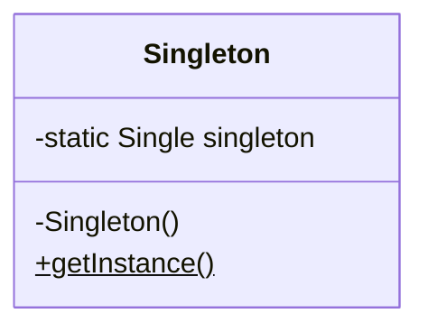

# Singleton 模式
程序在运行时，通常会生成很多实例。但是，**当我们想在程序中表示某个东西只会存在一个时，就会有“只能创建一个实例”的需求。**

当然，只要我们在编写程序时多加注意，确保只调用一次 new MyClass()，就可以达到只生成一个实例的目的。但是，如果我们不想
“必须多加注意才能确保生成一个实例”，而是要达到如下的目的时，应当怎么做呢？

- 想确保任何情况下都绝对只有 1 个实例
- 想在程序上表现出“只存在一个实例”

像这样的确保只生成一个实例的模式被称作 Singleton 模式。Singleton 是指只含有一个元素的集合。因为本模式只能生成一个
实例，因此以 Singleton 命名。更常见的一个叫法是单例模式。

# 类图

Singleton 类定义了 static 字段（类的成员变量） singleton，并将其初始化为 Singleton 类的实例。初始化行为仅在该类被加载时进行一次。

Singleton 类的**构造函数是 private** 的，这是为了禁止从 Singleton 类外部调用构造函数。Singleton 类中还有一个
getInstance 方法，以便于程序从 Singleton 类外部获取 Singleton 类唯一的实例。

# Singleton 模式中的登场角色

- Singleton

在 Singleton 模式中，只有 Singleton 这一个角色。Singleton 角色中有一个返回唯一实例的 static 方法。该方法总是会返回同一个实例。

# 扩展思路的要点
## 为什么必须设置限制
Singleton 模式对实例的数量设置了限制。为什么要在程序中特意设置这个限制呢？设置限制其实就是为程序添加一项前提条件。

当存在多个实例时，实例之间相互影响，可能会产生意想不到的 Bug。但是，如果我们可以确保只有一个实例，就可以在这个前提条件下放心地编程了。

## 何时生成这个唯一的实例
程序运行后，在第一次调用 getInstance 方法时，Singleton 类会被初始化。也就是在这个时候，static 字段 singleton 被初始化，生成了唯一的一个实例。

# 相关的设计模式
在以下模式中，多数情况下只会生成一个实例
- AbstractFactory 模式
- Builder 模式
- Facade 模式
- Prototype 模式

