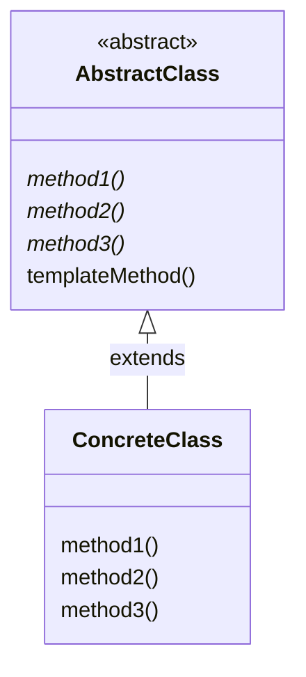

# Template Method 模式

## 什么是模板

模板的原意是指带有镂空文字的薄薄的塑料板。只要用笔在模板的镂空处进行临摹，即使是手写也能写出整齐的文字。虽然只要
能看到这些镂空的洞，就可以知道能写出哪些文字。但是具体写出的文字是什么样子则依赖于所用的笔。如果用签字笔来临摹，则
可以写出签字似的文字；如果使用铅笔来临摹，则可以写出铅笔字；而如果是用彩色笔临摹，则可以写出彩色的字。**但是无论
采用什么笔，文字的形状都会与模板上镂空处的形状一致**

## 什么是 Template Method 模式

Template Method 模式是带有模板功能的模式，组成模板的方法被定义在父类中。**由于这些方法是抽象方法，所以只查看父类的
代码是无法知道这些方法最终会进行何种具体处理的，唯一能知道的就是父类是如何调用这些方法的**。

实现上述这些抽象方法的是子类。**在子类中实现了抽象方法也就决定了具体的处理。也就是说，只要在不同的子类中实现不同的具体处理，
当父类的模板方法被调用时程序行为也会不同。但是，不论子类的具体实现如何，处理的流程都会按照父类中所定义的那样进行**。

**像这样在父类中定义处理流程的框架，在子类中实现具体处理的模式就称为 Template Method 模式**

# Template Method 模板中的登场角色

- AbstractClass（抽象类）

AbstractClass 角色不仅负责实现模板方法（本例为 Display 方法），还负责声明在模板方法中所使用到的抽象方法。这些抽象方法由子类 ConcreteClass 角色
负责实现。在 sample1 中，由 AbstractDisplay 类扮演此角色。

- ConcreteClass（具体类）

该角色负责具体实现 AbstractClass 角色中定义的抽象方法。这里实现的方法将会在 AbstractClass 角色的模板方法中被调用。
在 sample1 中，由 CharDisplay 类和 StringDisplay 类扮演此角色。

# Template Method 模式的类图

# 扩展思路的要点

## 可以使逻辑处理通用化

使用 Template Method 模式究竟能带来哪些好处呢？这里，**它的优点是由于在父类的模板方法中编写了算法，因此无需在每个子类中再编写算法。**

举个栗子，假如我们没有使用 Template Method 模式，而是利用复制粘贴编写了多个 ConcreteClass 角色。此时会出现 ConcreteClass1、
ConcreteClass2、ConcreteClass3 等很多相似的类。编写完成后立即发现了 Bug 还好，但如果过一段时间才发现在 ConcreteClass1
中有 Bug，该怎么办呢？这时，我们就必须将在这个 Bug 的修改反映到所有的 ConcreteClass 角色中才行。

**关于这一点，如果是使用 TemplateMethod 模式进行编程，当我们在模板方法中发现 Bug 时，只需要修改模板方法即可解决问题。**

## 父类与子类之间的协作

在 Template Method 模式中，父类和子类是紧密联系、共同工作的。因此，在子类中实现父类中声明的抽象方法时，
必须要理解这些抽象方法被调用的时机。在看不到父类的源代码的情况下，想要编写出子类是非常困难的。

## 父类和子类 的一致性

在 sample1 中，无论是 CharDisplay 的实例还是 StringDisplay 的实例，都是先保存在 AbstractDisplay 类型的变量中，
然后再来调用 display 方法的。

**使用父类类型的变量保存子类实例的优点是，即使没有用 instanceof 等指定子类的种类，程序也能正常工作。**

**无论在父类类型的变量中保存哪个子类的实例，程序都能正常工作，这种原则称为里氏替换原则（The Liskov Substitution Principle，LSP）。
当然 LSP 并非仅限于 Template Method 模式，它是通用的继承原则。**

# 相关的设计模式

- Factory Method 模式

Factory Method 模式是将 Template Method 模式用于生成实例的一个典型例子

- Strategy 模式

在 Template Method 模式中，可以**使用继承改变程序的行为**。这是因为 Template Method 模式在父类中定义程序行为的框架，在子类中决定具体的处理。

与此相对的是 Strategy 模式，它可以**使用委托改变程序的行为**。**与 Template Method 模式中改变部分程序行为不同的是，Strategy 模式用于替换整个算法。**

# 延伸阅读：类的层次和抽象类
## 父类对子类的要求
我们在理解类的层次时，通常是站在子类的角度进行思考的。也就是说，很容易着眼于以下几点。
- **在子类中可以使用父类中定义的方法**
- **可以通过在子类中增加方法以实现新的功能**
- **在子类中重写父类的方法可以改变程序的行为**

现在，让我们站在父类的角度进行思考。在父类中，我们声明了抽象方法，而将该方法的实现交给了子类。换言之，就程序而言，声明抽象方法是希望达到以下目的。
- **期望子类去实现抽象方法**
- **要求子类去实现抽象方法**

也就是说，子类具有实现在父类中所声明的抽象方法的责任。因此，这种责任被称为“子类责任”（subclass responsibility）

## 抽象类的意义
对于抽象类，我们是无法生成其实例的。在初学抽象类时，有人会有这样的疑问：“无法生成实例的类到底有什么作用呢？”，
现在学习了 Template Method 模式后，大家应该会有所感触。**由于抽象方法中并没有编写具体的实现，所以我们无法知道
在抽象方法中到底进行了怎么样的处理。但是我们可以决定抽象方法的名字，然后通过调用使用了抽象方法的模板方法去编写处理。
虽然具体的处理内容是由子类决定的，不过在抽象类阶段确定处理的流程非常重要。**

## 父类与子类之间的协作
父类与子类的相互协作支撑起了整个程序。**虽然将更多方法的实现放在父类中会让子类变得更轻松，但是同时也降低了子类的灵活性；
反之，如果父类中实现的方法过少，子类就会变得臃肿不堪，而且还会导致各子类间的代码出现重复。**

在 **Template Method 模式中，处理的流程被定义在父类中，而具体的处理则交给子类。但是对于“如何划分处理的几倍，哪些处理需要父类完成，哪些处理需要交给子类负责”
并没有定式，这些都需要由负责程序设计的开发人员来决定。**
